# User Authentication System with OTP Verification

This document provides UML diagrams for the signup and login processes of our user authentication system, which includes OTP verification via email.

## Complete Authentication Flow State Diagram

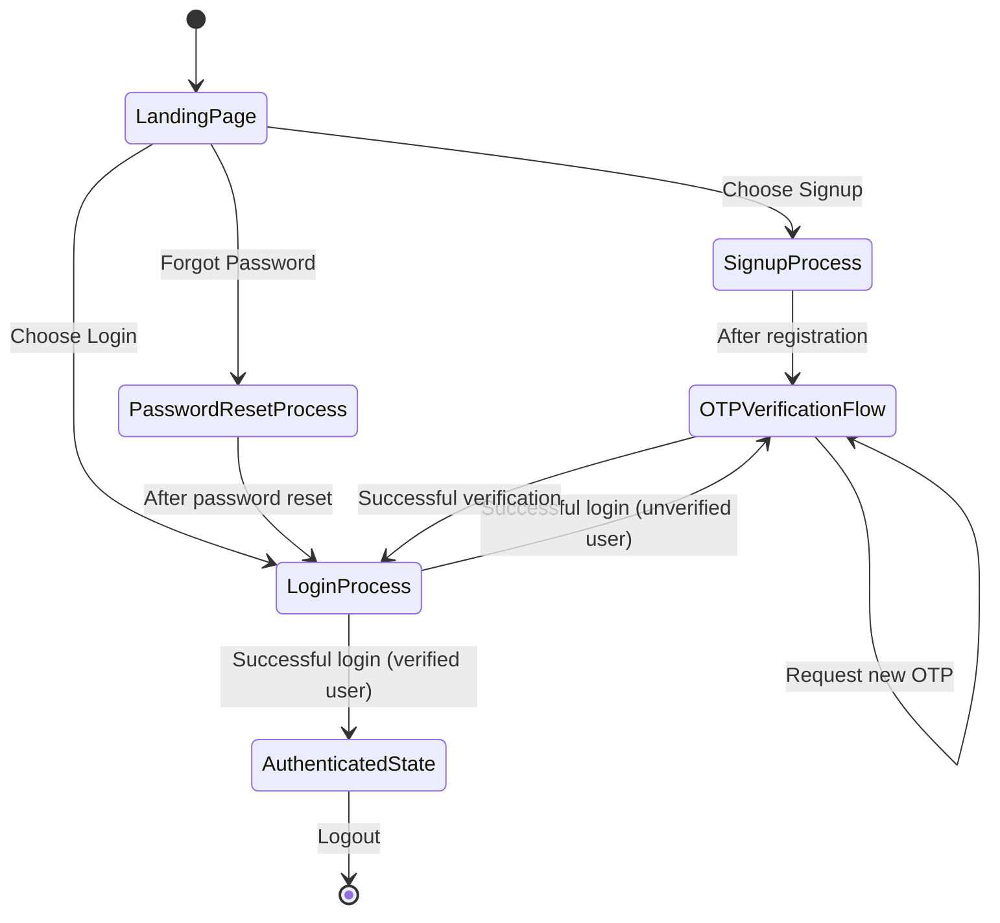

This state diagram represents the complete authentication flow, including signup, OTP verification, login, resend OTP, and password reset processes. It shows how these processes are interconnected and the various paths a user might take depending on different conditions and actions.

## User Entity

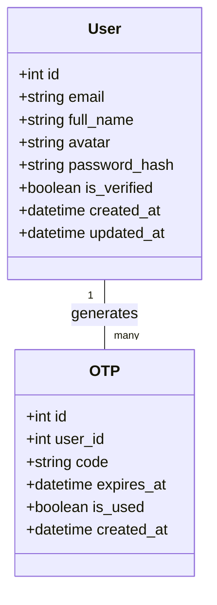

The User entity represents registered users in our system. Each user can have multiple OTP records associated with their account. The User entity stores essential information like email, name, and verification status, while the OTP entity tracks verification codes sent to users.

## Signup Process

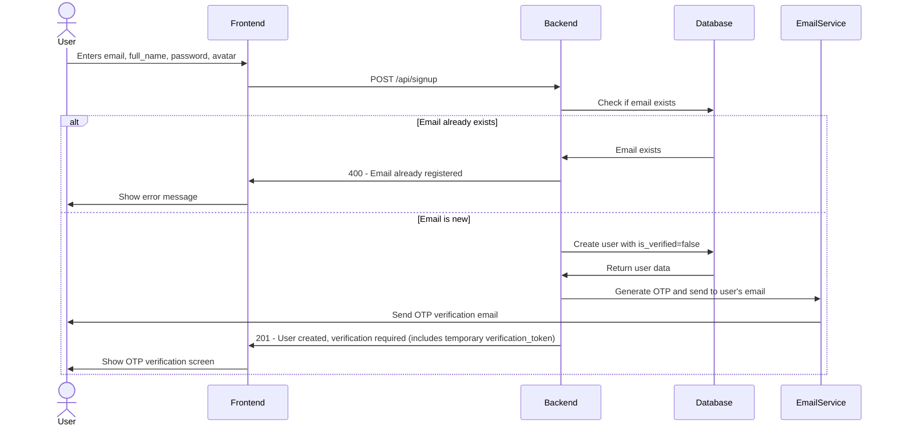

The signup process creates a new unverified user account. Upon successful user creation, the backend generates a temporary verification token (JWT with short expiry) that is returned to the frontend along with the 201 response. This verification token contains the user's ID and is required for the subsequent OTP verification step. The token is separate from the authentication JWT and is only used for the verification process.

## Signup Activity Diagram

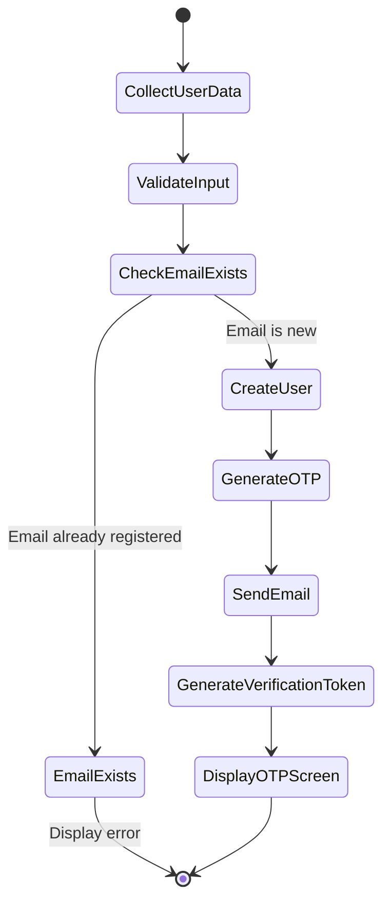

## OTP Verification Process

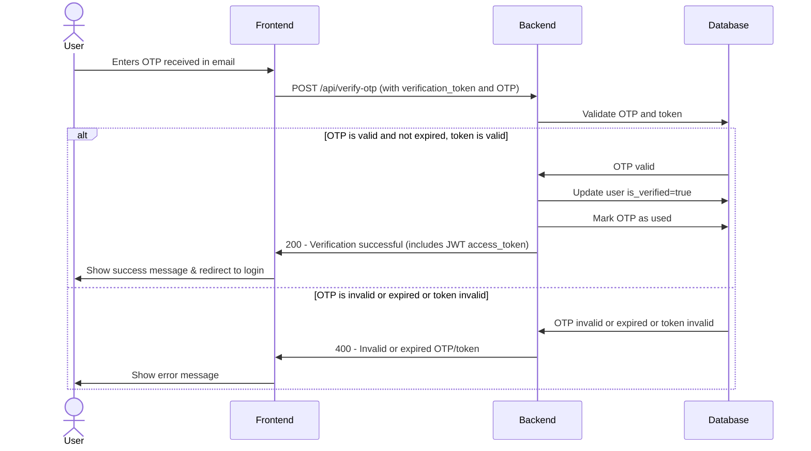

The OTP verification process validates the user's email address. The frontend must send both the OTP code and the verification token received during signup. The backend validates both the OTP and the verification token to ensure the request is legitimate. Once verified, the system marks the user as verified, marks the OTP as used, and returns a full access JWT token that can be used for subsequent authenticated requests. The verification token is valid for 5 minutes only.

## OTP Verification Activity Diagram

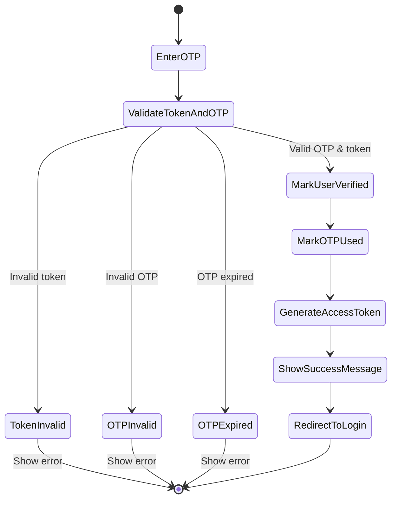

## Login Process

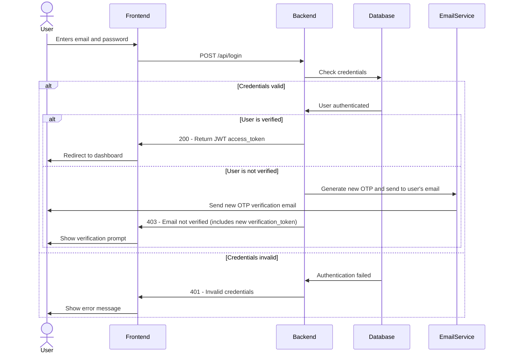

The login process authenticates users and provides access to the system. When credentials are valid and the user is verified, the backend returns a JWT access token that should be included in all subsequent authenticated requests. This token contains the user's ID and role information. If the user is not verified, the system automatically generates and sends a new OTP to the user's email, and the response includes a new verification token that can be used with the OTP verification endpoint to complete verification.

## Login State Diagram

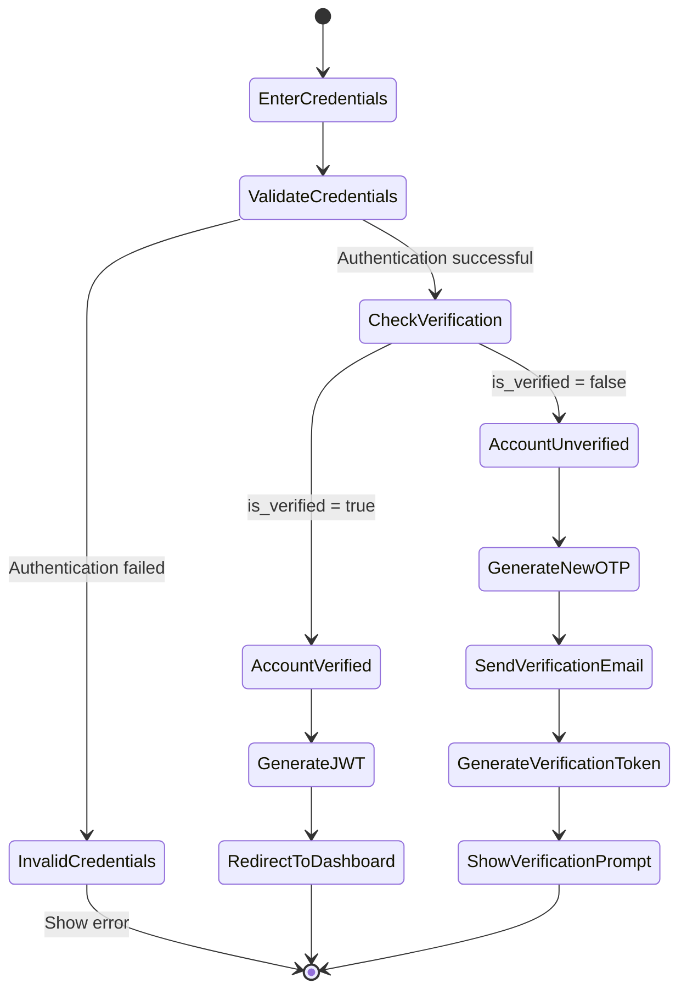

## Resend OTP API

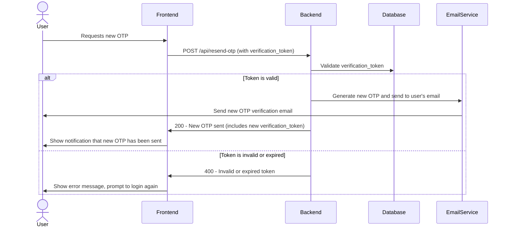

The Resend OTP API allows users to request a new OTP if the previous one expires or gets lost. The frontend must provide the current verification token, which is validated by the backend. If valid, a new OTP is generated and sent, and a new verification token is issued. This provides users with a way to recover from lost or expired OTPs without starting the entire signup or login process again.

## Resend OTP Activity Diagram

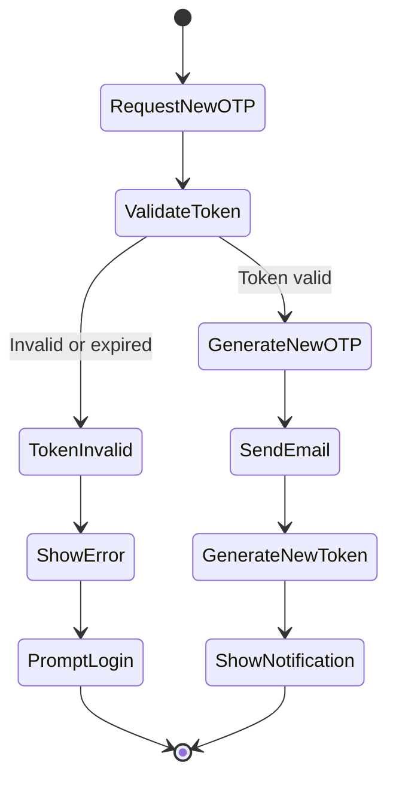

## Password Reset with OTP

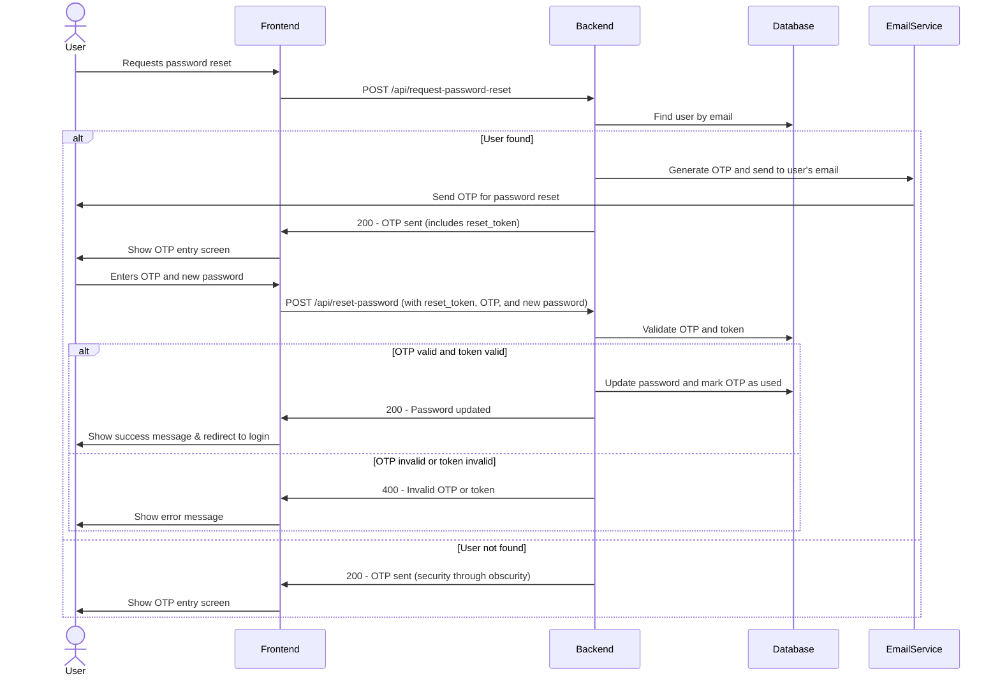

The password reset process provides a secure way for users to regain access to their accounts. When a reset is requested, the backend generates a special reset token (JWT with limited scope and short expiry) that is returned to the frontend. This token, along with the OTP and new password, must be included in the password reset request. The backend validates both the OTP and reset token before allowing the password change. This ensures that only users with access to the email account can reset the password.

## Password Reset Activity Diagram

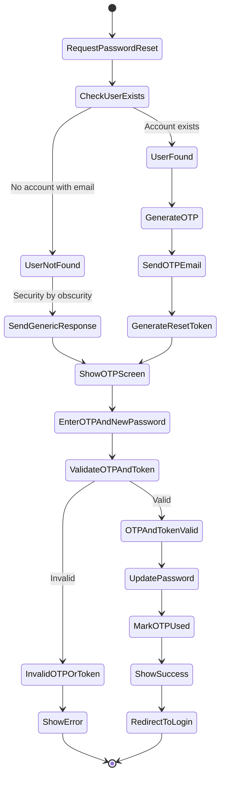
## Example User Data

| User ID | Email | Registration Status | Last Login | OTP Attempts |
|---------|-------|---------------------|------------|--------------|
| 1001 | alice@example.com | Verified | 2025-05-20 | 1 |
| 1002 | bob@example.com | Unverified | 2025-05-22 | 3 |
| 1003 | charlie@example.com | Verified | 2025-05-18 | 1 |
| 1004 | diana@example.com | Pending | 2025-05-24 | 2 |
| 1005 | evan@example.com | Verified | 2025-05-23 | 1 |
