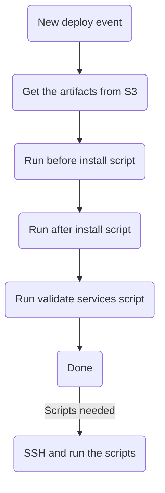

# Setting up auto deployment

These are the sequence of actions to setup the auto deployment:

## Step 1: Create an ECR repository
- Navigate to ECR in AWS, and create a new repository for main images.
![[Pasted image 20250527200926.png]]

- Also set a lifecycle policy to delete old images, ideally keeping the last 5 images.

## Step 2: Create CodeBuild project

- Create a CodeBuild project, go to `CodeBuild > Build Projects > Create build project` and use following configuration:

### Source section
- Connect GitHub in AWS and select the relevant repository.
![[Pasted image 20250527201059.png]]

### Environment section
- In the environment section, select an on-demand, managed, EC2 instance with Ubuntu and `aws/codebuild/standard:7.0` image.

> [!note]
> This is just preferred system for current project. Change this if there is better option

- Also select a service role to use. Either by creating a new one, or picking an existing.
![[Pasted image 20250527201156.png]]

- In the advanced section of this, set the environment variables that the build scripts need.

### Build spec section
- In this section, select `Use a buildspec file`, with the path as `aws/buildspec.yml`, which is part of source code.
**General structure of build spec:**
```yml
version: 0.2
env:
  variables:
    SCRIPT_DIR: "/var/www/deploy-scripts"

phases:
  install:
    commands:
      - nohup /usr/local/bin/dockerd --host=unix:///var/run/docker.sock --host=tcp://127.0.0.1:2375 --storage-driver=overlay2 &
      - timeout 15 sh -c "until docker info; do echo .; sleep 1; done"
      - aws --version
      - echo "Installing uv..."
      - curl -LsSf https://astral.sh/uv/install.sh | sh
      - export UV_PATH=/root/.local/bin
      - $UV_PATH/uv python install 3.13
  pre_build:
    commands:
      - ./aws/build_scripts/pre_build.sh
  build:
    commands:
      - ./aws/build_scripts/build.sh
  post_build:
    commands:
      - ./aws/build_scripts/post_build.sh

artifacts:
  files:
    - appspec.yml
```
### Logs section
- Enable the CloudWatch logs and provide a name.
## Step 3: Setup EC2 servers

!!! note "For a new EC2 instance, can select any instance type or configuration and follow the same steps."

1. First, add a service role for the EC2. There is already an existing service role, `AWS_Codedeploy_role`. This requires the following policies:
    - `AWSCodeDeployRole` - Default needed by CodeDeploy.
    - `AmazonS3FullAccess` - Needed by deploy agent to get build artifacts from S3.
    - `AWSAppRunnerServicePolicyForECRAccess` - Needed to load images from ECR.
    - `AmazonSSMReadOnlyAccess` - To get environment variables stored in AWS SSM Parameter Store.
    - `AmazonSSMManagedEC2InstanceDefaultPolicy` - For installing and updating code deploy agent.
    - `AmazonEC2RoleforAWSCodeDeploy` - Needed for code deploy.
    - _[Optional]_ `AmazonRoute53FullAccess` - Needed by `traefik` for automatically getting certificates domain.

2. Setup the docker compose for the project. This isn't dependant on the auto deployment. Only make sure that:
    - Its using image that's pulled by auto deployment scripts.
    - Its using image tags added in the .env by auto deployment scripts.

3. Make sure the necessary dependencies are available.
    - `aws cli v2`
    - `docker`
    - `docker-compsoe`

4. Clone/create deployment scripts as necessary in the instance.

5. Create a cronjob using `crontab -e`, with the line `0 5 * * * docker image prune -af`. This removes all images that are not being used, everyday at 5 AM UTC.

## Step 4: Setup CodeDeploy and deployment groups

- First create an Application in `CodeDeploy > Applications > Create application`, choose any name, and select `EC2/On-premises` as compute platform.

- Inside the Application, create a deployment group. The following checklist can help with that:
    -  Select a service role.
    - Select In-place as deployment type.
    - In Environment configuration, select `Amazon EC2 Instances`, and select all the matching EC2.
    - In `Agent configuration with AWS Systems Manager`, Select `Now and schedule updates`.
    - In the deployment settings, select `CodeDeployDefault.AllAtOnce`.
    - Disable load balancing option. Unless you know what you're doing and its needed.

## Step 5: Setup AWS SSM parameter store

- Upload the environment variables needed into AWS parameter store. There is a script `put_env.sh` in deployment scripts that helps with that. Make sure that the `SSM_PATH` variable is properly set.

> [!important] This works either from local, or from EC2 itself

- For changing environment variables, you can use one of the following approaches:
    - ***AWS parameter store UI:*** But can only update one variable at a time. But bulk deleting is possible.
    - ***Using `put_env.sh` script:*** Create a file containing environment variables to create/update. Use the `put_env.sh` to update these. But can't delete in this way.

> [!info]
> After updating parameters, just rerun the previous deployment to reflect the changes. *Running entire pipeline isn't necessary.*

## Step 6: Setup AWS CodePipeline

Create a CodePipeline with the following configuration:

### Pipeline settings section
- select a pipeline name.
- Pick Queued execution mode
- Create a new service role, with appropriate name

### Source stage section
- Select GitHub Version 2 source provider.
- Connect to GitHub or choose an existing connection.
- Select repository and branch.
- Add a filter for Trigger to run on pushing to a specific branch.

### Build stage section
- Select `AWS CodeBuild` as build provider.
- Choose source artifact as input artifact.
- Select the previously created CodeBuild project.

### Deploy stage section
- Select `AWS CodeDeploy` as deploy provider.
- Choose `BuildArtifact` as the input artifacts.
- Select the previously created CodeDeploy Application and deployment groups.

> [!info]
> Its possible to add multiple deployment sources, such as backend instances, live socket instance and instance used to push reports to elastic.

After this, can create the pipeline.

### Optional changes
6. Can create a manual approval stage in pipeline. This way, deployment doesn't happen right after building the image, and waits for approval.

7. Setup notifications using AWS SNS. Its out of scope of this document, but its possible to link it to Microsoft Teams using AWS ChatBot.

# CodeDeploy Working:

AWS CodeDeploy automatically deploys the changes after CodeBuild. This uses a code deploy agent in EC2. This listens to events emitted by AWS CodeDeploy, which contain the build artifacts.

## General working

For new image, the following is the structure:


Basic appspec.yml:
```yml
version: 0.0
os: linux

hooks:
  BeforeInstall:
    - location: before_install.sh
      timeout: 300
      runas: root
  AfterInstall:
    - location: install.sh
      timeout: 120
      runas: root
  ValidateService:
    - location: validate_service.sh
      timeout: 60
      runas: root
```

> [!note]
> Generally, in these scripts, we just run scripts that are already present in EC2.