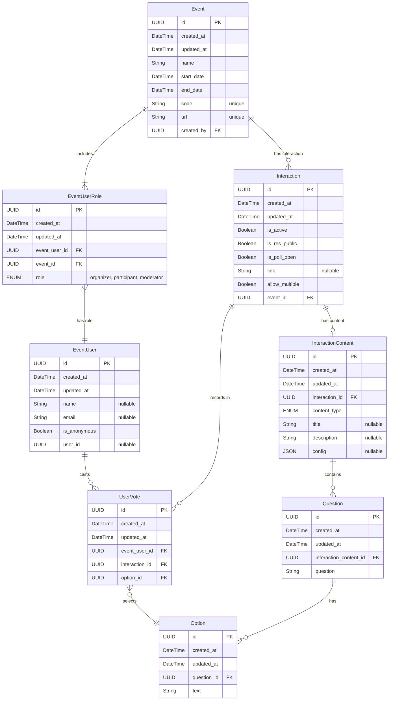

## Interactions & Event Data

```mermaid
erDiagram
    EventUser {
        UUID id PK
        DateTime created_at
        DateTime updated_at
        String name "nullable"
        String email "nullable"
        Boolean is_anonymous
        UUID user_id "nullable"
    }

    EventUserRole {
        UUID id PK
        DateTime created_at
        DateTime updated_at
        UUID event_user_id FK
        UUID event_id FK
        ENUM role "organizer, participant, moderator"
    }

    Event {
        UUID id PK
        DateTime created_at
        DateTime updated_at
        String name
        DateTime start_date
        DateTime end_date
        String code "unique"
        String url "unique"
        UUID created_by FK
    }

    Interaction {
        UUID id PK
        DateTime created_at
        DateTime updated_at
        Boolean is_active
        Boolean is_res_public
        Boolean is_poll_open
        String link "nullable"
        Boolean allow_multiple
        UUID event_id FK
    }

    InteractionContent {
        UUID id PK
        DateTime created_at
        DateTime updated_at
        UUID interaction_id FK
        ENUM content_type
        String title "nullable"
        String description "nullable"
        JSON config "nullable"
    }

    Question {
        UUID id PK
        DateTime created_at
        DateTime updated_at
        UUID interaction_content_id FK
        String question
    }

    Option {
        UUID id PK
        DateTime created_at
        DateTime updated_at
        UUID question_id FK
        String text
    }

    UserVote {
        UUID id PK
        DateTime created_at
        DateTime updated_at
        UUID event_user_id FK
        UUID interaction_id FK
        UUID option_id FK
    }

    Interaction ||--o| InteractionContent : "has content"
    Event ||--|{ EventUserRole : "includes"
    EventUserRole }|--|| EventUser : "has role"
    Event ||--o{ Interaction: "has interaction"
    InteractionContent ||--o{ Question : "contains"
    UserVote }o--|| Option : "selects"
    Question ||--o{ Option : "has"
    EventUser ||--o{ UserVote : "casts"
    Interaction ||--o{ UserVote : "records in"

```
