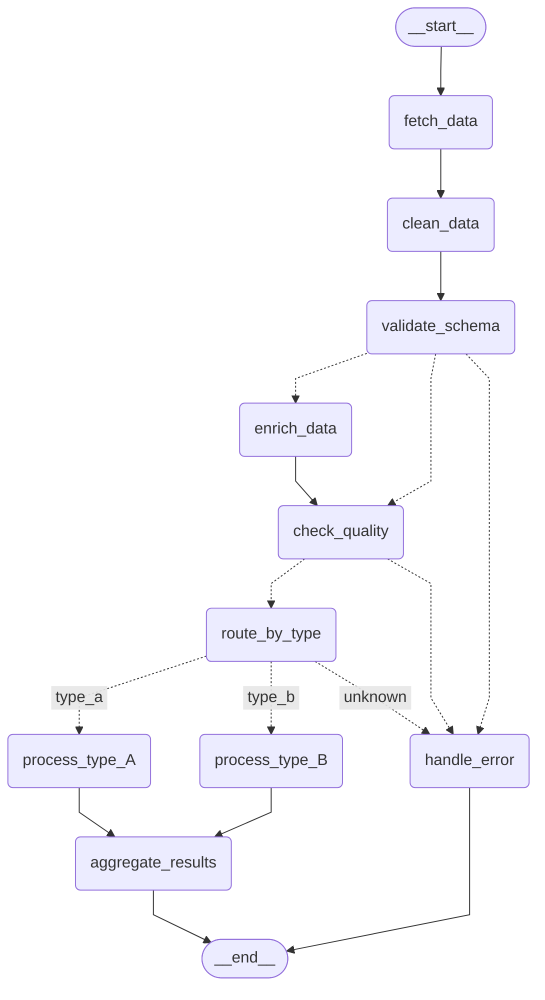

This explains how to use StateGraph in langgraph with Mermaid for visualizing the graph.

### Summary of the steps

1. Create StateGraph using `langgraph.graph.StateGraph` and compile using `app=graph.compile()`.
2. Print mermaid code using `app.get_graph().draw_mermaid()`.
3. Paste the printed mermaid code as markdown block, or in [Mermaid Playground](https://www.mermaidchart.com/play) to visualize.

## Step 1: Create a StateGraph

Create a StateGraph and add necessary nodes and edges. Following is an example graph:

```python
from langgraph.graph import StateGraph, END

# Declare state and nodes

# 1. Create the StateGraph
graph = StateGraph(DataProcessingState)

# 2. Add Nodes (10 nodes)
graph.add_node("fetch_data", fetch_initial_data_node)
graph.add_node("clean_data", clean_data_node)
graph.add_node("validate_schema", validate_schema_node)
graph.add_node("enrich_data", enrich_data_node)
graph.add_node("check_quality", check_quality_node)
graph.add_node("route_by_type", route_by_type_node) # Node to prepare for type routing
graph.add_node("process_type_A", process_type_A_node)
graph.add_node("process_type_B", process_type_B_node)
graph.add_node("aggregate_results", aggregate_results_node)
graph.add_node("handle_error", handle_error_node) # Error handling node

# 3. Add Edges (including branches)
graph.add_edge("fetch_data", "clean_data")
graph.add_edge("clean_data", "validate_schema")

# Branch 1: After schema validation
graph.add_conditional_edges(
    "validate_schema",
    route_after_validation, # Use the conditional function
    {
        "enrich_data": "enrich_data",
        "check_quality": "check_quality", # Direct path if no enrichment needed
        "handle_error": "handle_error",
    }
)

# Edge after enrichment (if taken)
graph.add_edge("enrich_data", "check_quality")

# Branch 2: After quality check
graph.add_conditional_edges(
    "check_quality",
    route_after_quality_check, # Use the conditional function
    {
        "route_by_type": "route_by_type", # If quality is good, go to type routing prep node
        "handle_error": "handle_error",   # If quality is bad, go to error handling
    }
)

# Branch 3: After route_by_type prep node (actual routing based on data_type state key)
graph.add_conditional_edges(
    "route_by_type",
    lambda state: state["data_type"], # Direct lambda reading state key
    {
        "type_a": "process_type_A",
        "type_b": "process_type_B",
        "unknown": "handle_error", # Handle case where type couldn't be determined
    }
)

# Edges merging back or going to END
graph.add_edge("process_type_A", "aggregate_results")
graph.add_edge("process_type_B", "aggregate_results")

# Paths leading to the end of the graph
graph.add_edge("aggregate_results", END)
graph.add_edge("handle_error", END)

# 4. Set the Entry Point
graph.set_entry_point("fetch_data")

# Note: END is the implicit finish point(s) here. You could also set a specific finish point
# if you had a final "Report Success" node before END, for example.

# 5. Compile the Graph
app = graph.compile()
```


## Step 2: Print the mermaid code StateGraph
Langgraph provides a method on StateGraph to print the mermaid block, which we will use.

```python
print(app.get_graph().draw_mermaid())
```

For above example, this is the code printed:
```
---
config:
  flowchart:
    curve: linear
---
graph TD;
	__start__([<p>__start__</p>]):::first
	fetch_data(fetch_data)
	clean_data(clean_data)
	validate_schema(validate_schema)
	enrich_data(enrich_data)
	check_quality(check_quality)
	route_by_type(route_by_type)
	process_type_A(process_type_A)
	process_type_B(process_type_B)
	aggregate_results(aggregate_results)
	handle_error(handle_error)
	__end__([<p>__end__</p>]):::last
	__start__ --> fetch_data;
	aggregate_results --> __end__;
	clean_data --> validate_schema;
	enrich_data --> check_quality;
	fetch_data --> clean_data;
	handle_error --> __end__;
	process_type_A --> aggregate_results;
	process_type_B --> aggregate_results;
	validate_schema -.-> enrich_data;
	validate_schema -.-> check_quality;
	validate_schema -.-> handle_error;
	check_quality -.-> route_by_type;
	check_quality -.-> handle_error;
	route_by_type -. &nbsp;type_a&nbsp; .-> process_type_A;
	route_by_type -. &nbsp;type_b&nbsp; .-> process_type_B;
	route_by_type -. &nbsp;unknown&nbsp; .-> handle_error;
	classDef default fill:#f2f0ff,line-height:1.2
	classDef first fill-opacity:0
	classDef last fill:#bfb6fc
```

## Step 3: Displaying the mermaid graph

There are 2 ways to display the mermaid graph:

### Option 1: Using markdown
- Most IDE have extension to display mermaid diagrams.
- Even github markdown viewer supports mermaid diagrams.

**Create a markdown file and add code block in following way:**


 This is how this gets displayed for above example:


> [!note]
> I removed last few lines related to styling so that it matches website/doc theme.

### Option 2: Using mermaid playground

- Mermaid has a online playground to view, edit and download mermaid diagrams.
- You can only save 3 diagrams in cloud per account, but can edit and download unlimited.
- You can visit here: [Mermaid Chart - Create complex, visual diagrams with text. A smarter way of creating diagrams.](https://www.mermaidchart.com/play)

For the given example:


You can then export this as image using the export feature:


> [!note]
> I modified the config block at top in the playground to use my preferred theme.