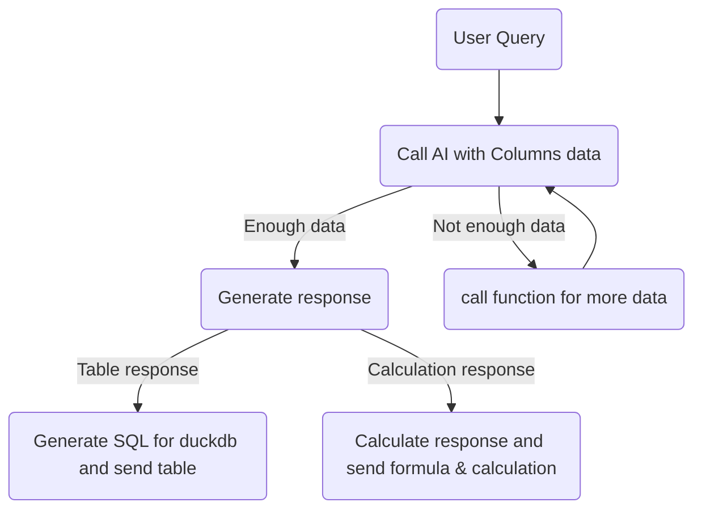

#### Things missing in PoC:
- ***Comparing peers data.*** Can implement by adding a function for getting peers data
- ***Returning charts/graphs:*** Currently only returning tables or text. Can inegrate other output formats by giving context to AI.

**NOTE:**
- In PoC, it might interpret question somewhat incorrectly. Need to provide more context for better results.