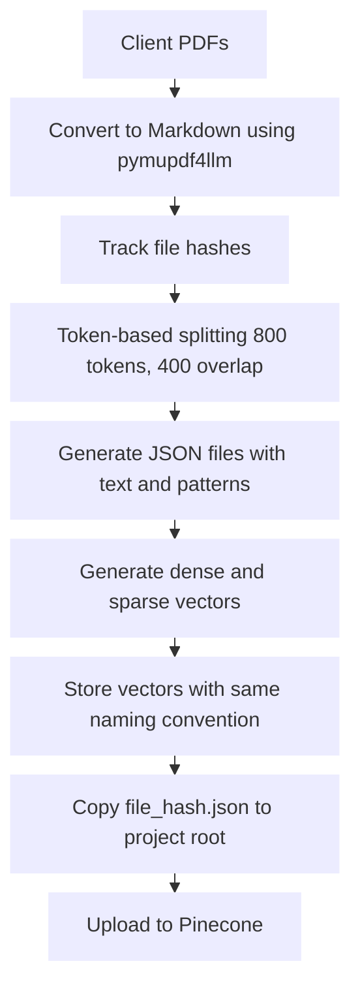
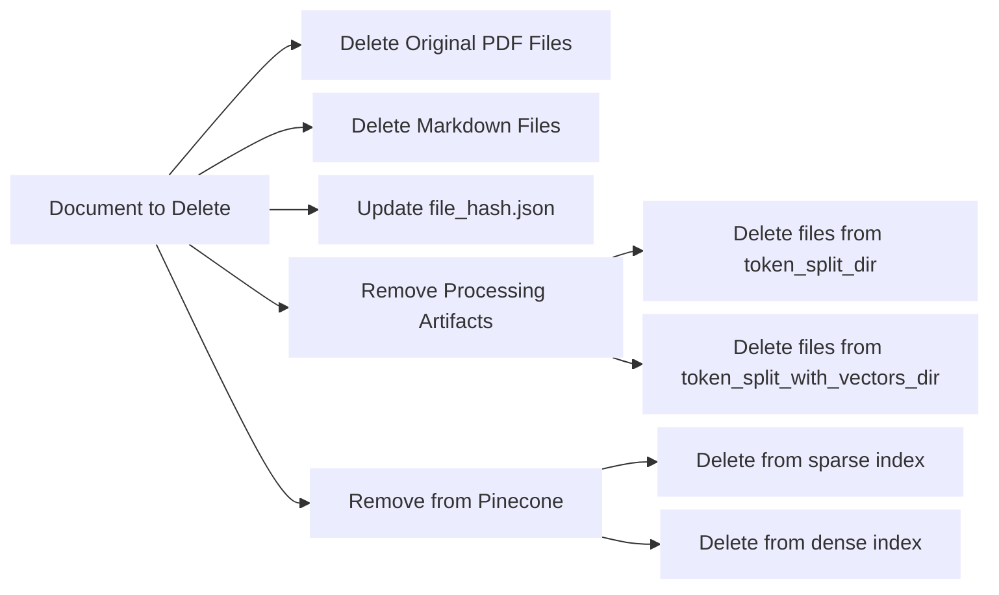
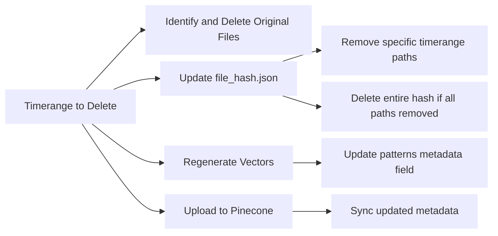

We tried 2 chunking strategies:

1. Semantic chunking
2. Token based chunking

Semantic chunking did not give expected results, so we are now using token based.

## Token based chunking strategy:

Token-based chunking is our current approach for processing legislation documents. Here's how the process works:
1. **Document Collection and Conversion**
   - Receive legislation documents from clients in PDF format
   - Store in a dedicated folder with meaningful filenames
   - Track file hashes to identify duplicate documents
   - If a PDF with a specific hash is already processed, only the new file path is appended in file_hash.json
	**For LIs (Legal Instruments)**
	- Use **pymupdf4llm** conversion method
	- Command: `python -m ragcore.markdown_chunking.create_markdown <pdf_data_base> <markdown_data_dir> --pattern "**/legislation/LIs/*.pdf"`
	
	**For Acts and Regulations**
	- Use **pymupdf** conversion method (more complete paragraph capture)
	- Command: `python -m ragcore.markdown_chunking.create_markdown_new <pdf_data_base> <markdown_data_dir> --pattern "**/legislation/pdf/*.pdf"

2. **Token-Based Text Splitting**
   - Process markdown files using tiktoken-based text splitter
   - Create chunks of 800 tokens with 400 token overlap
   - Generate JSON files identified by file hash and index
   - Each JSON contains the text chunk and "patterns" metadata

   **Token Splitting Command:**
   ```
   python -m ragcore.markdown_chunking.token_splitter <markdown_data_dir> <token_split_dir>
   ```

   This command splits markdown files into token-based chunks and stores the results as JSON files.

3. **Adding page range**
   - Add the start and end page range for each chunk
   - Command: 

3. **Adding summary** (Optional)
   - Optionally, generate a rolling summary for each chunk.
   - Command: `python -m ragcore.markdown_chunking.rolling_summary --path <token_split_dir> --hash-file <filehash.json path>`

3. **Vector Generation**
   - Generate dense vectors (voyage-law-2) and sparse vectors (bm25) for each JSON file
   - Store vectors in a third directory, maintaining the naming convention
   - If vectors already exist for a particular hash, only update the patterns

   **Vector Generation Command:**
   ```
   python -m ragcore.markdown_chunking.generate_vectors <token_split_dir> <token_split_with_vectors_dir>
   ```

   This command generates vector embeddings for each chunk and adds them to the JSON files.

4. **Pinecone Upload**
   - Copy the file_hash.json from the markdown content folder to project root
   - Run upload task to synchronize all chunks with Pinecone
   - All chunks are re-uploaded to ensure metadata is current

   **Pinecone Upload Command:**
   ```
   python -m ragcore.markdown_chunking.upload_to_pinecone --sparse --dense <token_split_with_vectors_dir>
   ```

   This command uploads both sparse and dense vectors to the Pinecone database.

### Additional notes on token chunking

- pymupdf4llm preserves document structure during PDF to markdown conversion
- Hash-based approach prevents redundant processing of identical documents
- Combination of voyage-law-2 and bm25 creates a hybrid retrieval system
- 400-token overlap maintains context across chunk boundaries


### Deleting specific files:

To completely remove a document from the system, follow these steps to ensure it's deleted from all locations:

1. **Delete Original Data Files**
   - Remove the original PDF file from all directories where it exists
   - This prevents the file from being reprocessed in future runs

2. **Delete Markdown Files**
   - Delete the associated markdown file that was created during conversion

3. **Update file_hash.json**
   - Open the file_hash.json and locate the hash of the document to be deleted
   - Remove the entire entry for that hash
   - This prevents the system from tracking the file in the future

4. **Remove Processing Artifacts**
   - Delete all files in the token_split_dir that start with the document's hash
   - Delete all files in the token_split_with_vectors_dir that start with the document's hash
   - This removes all chunked content and embeddings

5. **Remove from Pinecone**
   - Delete all records starting with the document's hash from both the sparse and dense Pinecone indices
   - This ensures the document isn't retrievable in search results

By completing all these steps, you ensure the document is completely removed from the system and won't be reprocessed or retrieved in the future.



### Deleting documents from a specific timerange:

To remove documents that fall within a particular timerange, follow these steps:

1. **Identify and Delete Original Dataset Files**
   - Identify PDF files that fall within the specified timerange
   - Remove these files from the original dataset directories
   - This prevents reprocessing of the timerange-specific documents

2. **Update file_hash.json**
   - Open the file_hash.json file
   - Locate entries associated with the timerange
   - Remove only the specific file paths that fall within the timerange
   - If all paths for a hash are removed, delete the entire hash entry
   - Save the updated file_hash.json

3. **Regenerate Vectors**
   - Run the vector generation task to update the patterns field:
     ```
     python -m ragcore.markdown_chunking.generate_vectors <token_split_dir> <token_split_with_vectors_dir>
     ```
   - This preserves existing vectors but updates metadata to reflect the removed timerange data

4. **Upload Updated Data to Pinecone**
   - Run the Pinecone upload command to synchronize metadata:
     ```
     python -m ragcore.markdown_chunking.upload_to_pinecone --sparse --dense <token_split_with_vectors_dir>
     ```
   - This updates the metadata in Pinecone without regenerating vectors

This approach efficiently removes timerange-specific documents while maintaining the integrity of the remaining data and minimizing processing overhead.

