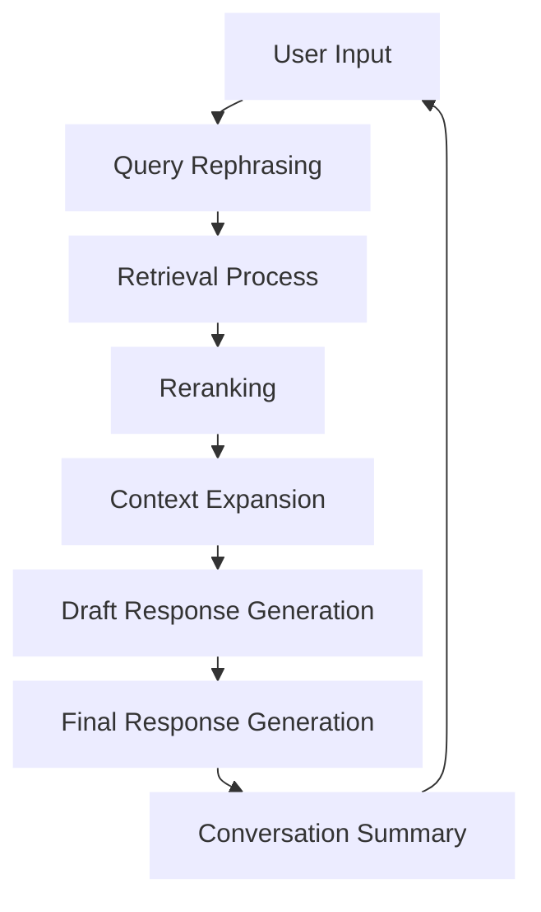
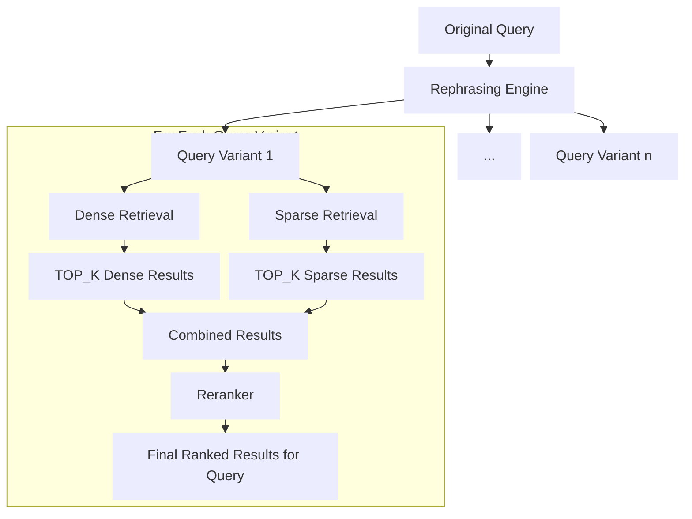
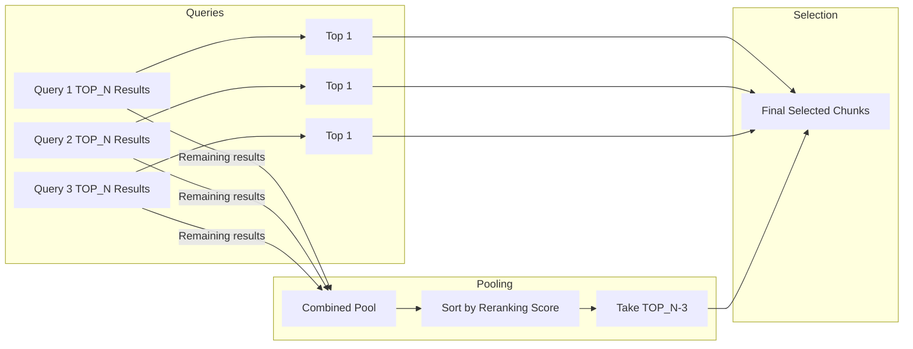
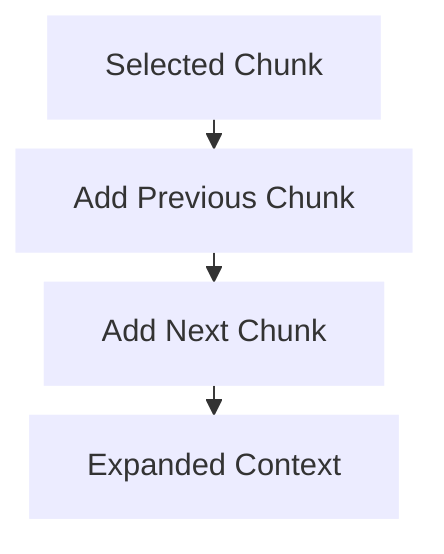

This document explains how conversation works in a Retrieval-Augmented Generation (RAG) model, detailing the process from user input to response generation.

## Overall Process

RAG models enhance Large Language Models (LLMs) by retrieving relevant information from a knowledge base before generating responses. This allows the model to access specific information that might not be in its training data.

### Conversation Flow

## Detailed Steps

### 1. User Input Processing
The system receives the user's message, which serves as the initial query.

### 2. Query Rephrasing
The system rephrases the original query to create up to 5 different versions that approach the topic from multiple perspectives.

### 3. Retrieval and Reranking Process
The system retrieves and reranks relevant information using both semantic and keyword-based approaches.

#### Query Processing

#### Results Selection Across Queries

**Example:**
Assume we have 3 query variants and want to select TOP_N = 7 chunks:

1. For each query variant, we retrieve and rerank chunks independently:
   - Query 1: Chunks 1A, 1B, 1C, 1D, ... (ranked by relevance)
   - Query 2: Chunks 2A, 2B, 2C, 2D, ... (ranked by relevance)
   - Query 3: Chunks 3A, 3B, 3C, 3D, ... (ranked by relevance)

2. We first select the top chunk from each query:
   - 1A from Query 1
   - 2A from Query 2
   - 3A from Query 3

3. For the remaining TOP_N-3 = 4 slots:
   - We pool the next TOP_N-1 = 6 chunks from each query: 1B, 1C, 1D, 1E, 1F, 1G, 2B, 2C, 2D, 2E, 2F, 2G, 3B, 3C, 3D, 3E, 3F, 3G
   - Sort all 18 chunks by their reranking score
   - Select the top 4 highest-scoring chunks from this combined pool

4. The final selection consists of 7 chunks: 1A, 2A, 3A, plus the 4 highest-scoring chunks from the combined pool.

This approach ensures diversity (by including top results from each query variant) while also prioritizing overall relevance (by selecting the highest-scoring remaining chunks).

### 4. Context Expansion
For each selected chunk, the system retrieves and attaches the preceding and following chunks from the source document, providing additional context. When chunks have overlapping content, the overlap is combined to avoid duplication.

**Example:**
Assume we have 800-token chunks with 400-token overlap:

- Original Chunk 1: Tokens 800-1599
- Original Chunk 2: Tokens 1200-1999 (overlaps with Chunk 1)
- Original Chunk 3: Tokens 1600-2399 (overlaps with Chunk 2)

If Chunk 2 is selected during retrieval, the context expansion would:
1. Add Chunk 1 (previous), combining the overlapping 400 tokens
2. Add Chunk 3 (next), combining the overlapping 400 tokens

The expanded context would then contain tokens 800-2399, with duplicate content in the overlapping regions merged.
This creates a seamless context window of 1600 tokens around the selected chunk while avoiding redundancy.

### 5. Draft Response Generation
The expanded chunks and conversation history are sent to the LLM to generate a draft response, focusing on paraphrasing information from the chunks and selecting relevant parts.

### 6. Final Response Generation
The system refines the draft response using the conversation history to create a coherent, contextually appropriate answer for the user.

### 7. Conversation Summarization
After sending the response, the system creates a summary of the conversation thus far. This summary is used to provide context for processing the next user query, especially during the query rephrasing stage.

## Advantages of This Approach

1. **Multiple perspectives**: By rephrasing queries, the system captures different aspects of the user's intent.
2. **Diverse retrieval**: Using both dense and sparse retrieval methods ensures broad coverage.
3. **Context preservation**: Including surrounding chunks maintains the broader context.
4. **Two-stage generation**: The draft-then-refine approach allows for both accuracy and coherence.
5. **Conversation awareness**: The summary ensures continuity across multiple turns.

This multi-step process ensures that responses are both information-rich and conversationally appropriate.