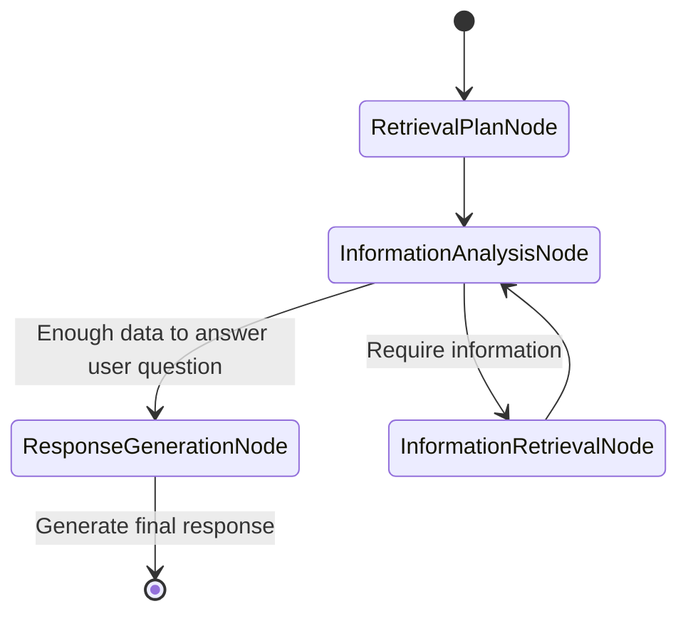

## InformationAnalysisNode

```python
@dataclass
class InformationAnalysisNode(BaseNode[State]):
    async def run(self, ctx: GraphRunContext[State]) -> InformationRetrievalNode | ResponseGenerationNode:
```

**Purpose**: 
- Serves as the entry point and decision-maker for query processing
- Analyzes the complexity of the user query and determines the next action

**Functionality**:
- Uses the `information_analysis_agent` to evaluate the query
- If the query is simple (like "Hello"), routes directly to `ResponseGenerationNode`
- For complex queries, routes to `InformationRetrievalNode` with specific retrieval parameters

**Agent Behavior**:
- Can return either `RequiresInformation` (for retrieval) or `CanGenerateResponse` (to skip retrieval)
- For complex queries, breaks them down into multiple aspects for targeted retrievals

## InformationRetrievalNode

```python
@dataclass
class InformationRetrievalNode(BaseNode[State]):
    retrieval_query: str
    legal_date: date | Literal["present"] = "present"
    search_type: Literal["dense", "sparse", "hybrid"] = "dense"
    aspect: str = "general"
```

**Purpose**:
- Performs the actual information retrieval operations
- Extracts and organizes facts from retrieved documents

**Functionality**:
- Executes retrieval using specified search type (dense/sparse/hybrid)
- Adaptively switches search methods if initial results are insufficient
- Uses `fact_extractor_agent` to process retrieved chunks and extract relevant facts
- Organizes facts by aspect and retrieval query
- Incrementally builds up the knowledge base in `state.retrieved_facts`
- Tracks retrieval attempts and enforces the maximum limit

**Retrieval Logic**:
- Dense retrieval: Uses semantic similarity (better for conceptual queries)
- Sparse retrieval: Uses keyword matching (better for specific terminology)
- Hybrid retrieval: Combine dense and sparse retrievals and perform reranking
- Automatically falls back to alternative method if primary method yields few results
- Merges results without duplicates

**Decision Making**:
- Based on the `fact_extractor_agent` response (`ContinueRetrieval` or `GenerateResponse`)
- Can route to another `InformationRetrievalNode` for more information
- Routes to `ResponseGenerationNode` when sufficient facts are gathered or max retrievals reached

## ResponseGenerationNode

```python
@dataclass
class ResponseGenerationNode(BaseNode[State, None, str]):
    async def run(self, ctx: GraphRunContext[State]) -> End[str]:
```

**Purpose**:
- Final node in the process
- Synthesizes all retrieved information into a coherent response

**Functionality**:
- Uses a dedicated response generator agent
- Considers all facts gathered across multiple retrievals
- Formats response with proper sections, bullet points, and source citations
- Includes appropriate disclaimers about the limitations of the information

**Response Characteristics**:
- Addresses all aspects of the user's query
- Clearly indicates missing or ambiguous information
- Provides source filenames as footnotes
- Explains discrepancies in contradictory information
- Includes disclaimers about the information's completeness
- For legal/immigration queries, advises consulting with official sources

This architecture ensures the system can handle both simple queries efficiently and complex queries thoroughly, with appropriate information gathering before response generation.