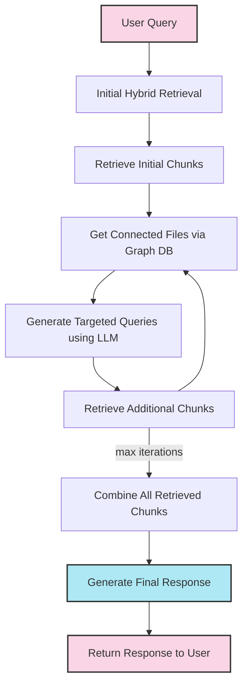
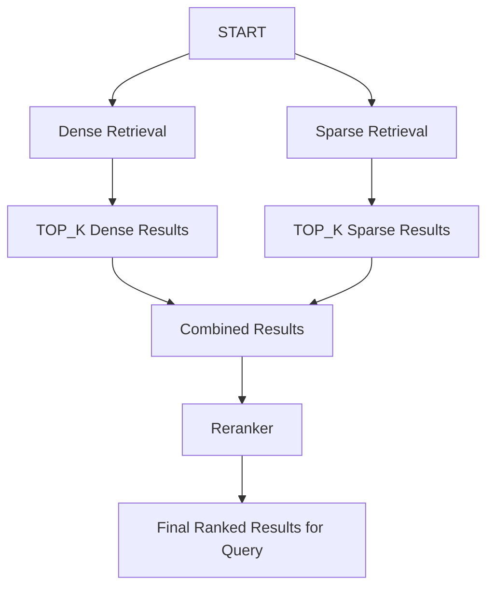

This is currently used approach.

## Overview

**User Query**: The process begins when a user submits a question or query to the system.

**Initial Hybrid Retrieval**: The system performs an initial search using a combination of methods (Vector + Sparse search) to find relevant information. **Currently, retrieves top 5**

**Get Connected Files via Graph DB**: Using a knowledge graph database, the system identifies all the outgoing references from retrieved chunks.

**Generate Targeted Queries using LLM**: A Large Language Model analyzes the current context and generates more specific, focused follow-up queries to do on top of each related file.

**Retrieve Additional Chunks**: These targeted queries are used to retrieve additional information chunks that might have been missed in the initial retrieval. **Currently retrieves top 3 for each targeted query**

**Recursive Loop**: The system cycles through retrieving connected files, generating targeted queries, and retrieving additional chunks. **(This is repeated twice)**

**Combine All Retrieved Chunks**: After completing the recursive retrieval process, all the gathered information chunks are combined into a comprehensive context.

**Generate Final Response**: The LLM uses all retrieved information to craft a comprehensive and accurate response to the original query.

**Return Response to User**: The final answer is presented to the user who submitted the original query.

### Hybrid retrieval process

[Check this for more info on how chunks are created.](/notes/konze-legal-ai/chunking-strategy)
## LLM agents

- We are using 2 LLM agents. One for generating targeted queries. Another for final response generation.
### Targeted Query Agent

(Defined in `ragcore/agentic/fsm_knowledge_graph.py`)
- The agent accepts user query, and a list of interconnections that are retrieved from graph db.
- Returns specific search queries for each selected file.
- The output is a **structured CSV list** of filename-query pairs.

### Response generation agent

(Defined in `ragcore/agentic/fsm_knowledge_graph.py`)

- Accepts retrieved chunks formatted as xml, user query, and conversation history.
- Generates the final response.